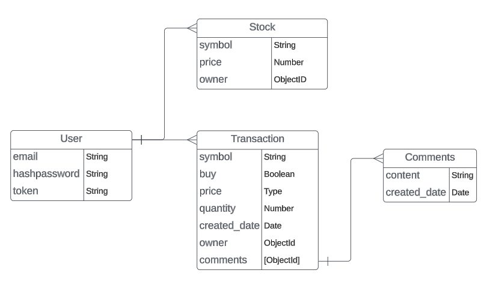

# Stock Playground API

This is the backend for the full stack stock app for anyone that wants to practice stock exchange for free and no risk.

## Technologies Used

- MongoDB
- Express.js
- Node.js


## Planning section


### ERD




## API

Scripts are included in [`curl-scripts`](curl-scripts) to test built-in actions. Feel free to use Postman for testing, using the curl scripts listed below and in the folder for setting up headers and request bodies.
Add your own scripts to test your custom API.

### Authentication

| Verb   | URI Pattern            | Controller#Action |
|--------|------------------------|-------------------|
| POST   | `/sign-up`             | `users#signup`    |
| POST   | `/sign-in`             | `users#signin`    |
| PATCH  | `/change-password/` | `users#changepw`  |
| DELETE | `/sign-out/`        | `users#signout`   |

### Stocks

| Verb   | URI Pattern            | Controller#Action |
|--------|------------------------|-------------------|
| GET   | `/stocks`             | `stocks#index`    |
| GET   | `/stocks/<stock_id>`    | `stocks#show`    |
| POST   | `/stocks`             | `stocks#create`    |
| PATCH  | `/stocks/<stock_id>` | `stocks#update`  |
| DELETE | `/stocks/<stock_id>`        | `stocks#delete`   |

### Transactions

| Verb   | URI Pattern            | Controller#Action |
|--------|------------------------|-------------------|
| POST   | `/transaction`         | `transaction#create`    |


### Comments

| Verb   | URI Pattern            | Controller#Action |
|--------|------------------------|-------------------|
| POST   | `/comments/<transaction_id>`             | `comments#create`    |
| PATCH  | `/comments/<transaction_id>` | `comments#update`  |
| DELETE | `/comments/<transaction_id>`        | `comments#delete`   |

#### Recommended Request bodies

Request - users#signup:

```json
{
    "credentials": {
      "email": "an@example.email",
      "password": "an example password",
      "password_confirmation": "an example password"
    }
}
```

Request - stocks#create (requires a token):

```json
{
    "stock": {
        "symbol": "IBM",
        "price": "234.34",
        
    }
}
```

### Token Auth Strategy

Send the token as `Bearer Token <token>`